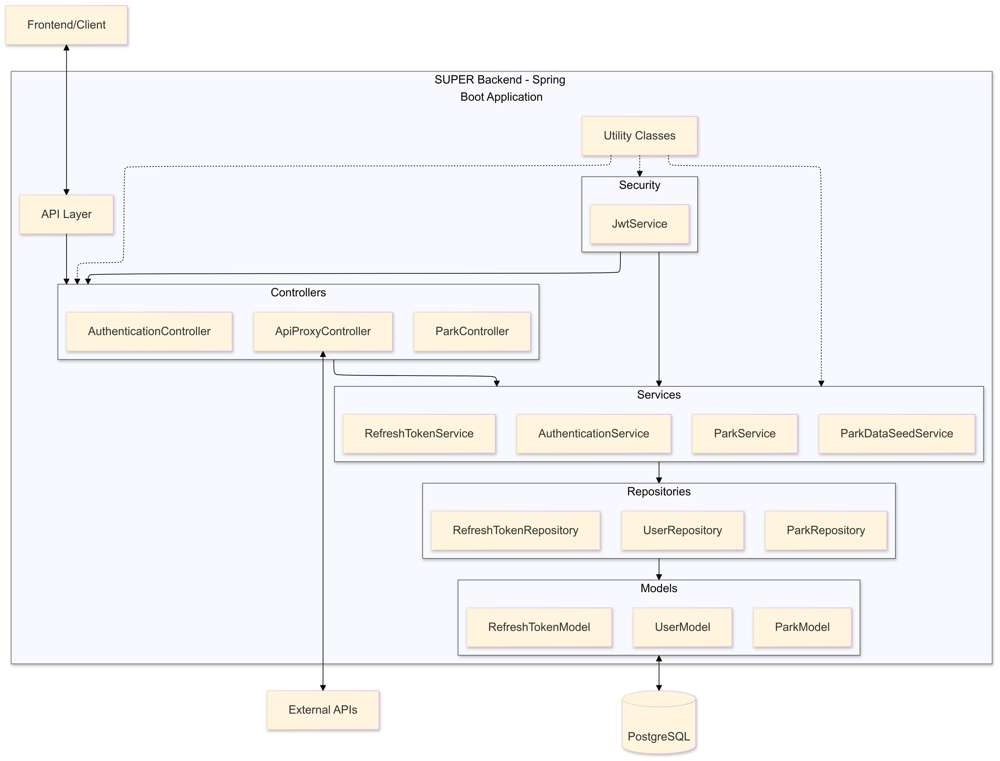

# LEEDS BECKETT UNIVERSITY
**SCHOOL OF BUILT ENVIRONMENT, ENGINEERING AND COMPUTING**


## Small Urban Park Environments &amp; Residents (SUPER) Mobile Application Prototype for the Leeds Sustainability Institute (LSI)

Submitted to Leeds Beckett University in partial fulfilment of the requirements for the degree of MSc Information and Technology

By ***Albert Tarkaa Ago, Student ID: 77368783***

Supervised by ***[Dr. Gopal Jamnal](https://www.leedsbeckett.ac.uk/staff/dr-gopal-jamnal)***

September, 2024


## Project Overview

This project involves:
- Researching similar initiatives.
- Designing and developing a prototype app.
- Utilizing OpenStreetMap data or Mapbox for park information.

## Features

### Must-Have Features - These are the fundamental features the app must have to meet user expectations

- Users can locate parks and green spaces within Leeds city. &#9989;
- Directions on how to access the parks and green spaces on foot, by cycle and by bus. &#9989;
- Details about parks and green spaces facilities and accessibility, family and children friendliness including toilets, benches, bins, water fountains and sand areas.&#9989;
- Information on the events happening, and when parks and green spaces are open. &#9989;
- Access to microclimate and air quality data - Display of average and current air quality data, UV levels, and pollen count in the parks and green spaces. &#9989;

## Technologies Used
- **Backend**: Spring Boot, Java v17, PostgreSQL v16
- **Tools**: Git, IntelliJ IDEA, Postman, pgAdmin, Maven, Docker
- **Documentation**: Postman. Documentation can be found [here](https://documenter.getpostman.com/view/32686033/2sA3s7kpho)


Architectural Diagram

## Setting up the project
1. Clone the repository
2. Open the project in IntelliJ IDEA or any other Java IDE.
3. Download and install PostgreSQL, create a PostgreSQL database named `super` and update the `application.properties` 
   file with your database 
   credentials.
4. Make sure you have all the API keys for the third-party APIs used in the project defined in the `application.
   properties` file or the `.env.properties` file.
5. Run the project which has port 8080 defined in the `application.properties` file, change the port if necessary.
6. It is necessary to tunnel the application to the internet using a service like [ngrok](https://ngrok.com) to enable 
   the React Native app to access the application. This is the link to the Ngrok documentation page for more 
   information on how to set up ngrok: [Ngrok Documentation](https://ngrok.com/docs/getting-started)
7. Once your have signed up for an account on ngrok, download and install ngrok, set up your auth token and run the 
   following 
   command to tunnel 
   the application to the internet:
   ```shell
   ngrok http http://locahost:<port>
   ```
8. Replace the API_URL value with the Backend URL provided by Ngrok on line 5 of

   ```bash
      components/Utils/ProxyAPICalls.tsx
   ```
   in the frontend project.

## Third-party APIs Used
- [WeatherAPI](https://https://www.weatherapi.com)
    - Used to fetch current and 7-day forecast weather data for Leeds, UK.
    - Endpoint: ``` 
                    /api/v1/proxy/weather
                 ```
- [AirVisual](https://www.iqair.com)
  - Used to get the air quality data.
    Purpose: Retrieves air quality data based on latitude and longitude.
    
  - Endpoint: ``` 
                  /api/v1/proxy/air-quality
               ``` 
- [OpenRoute](https://openrouteservice.org)
    - Provides directions data based on start and end locations and travel profile.
    - Also used for fetching Points of Interest (POIs) around a specific location.
    - Endpoint: ``` 
                    /api/v1/proxy/directions
                 ```
    - Endpoint: ``` 
                    /api/v1/proxy/points-of-interest
                 ```
- [VoiceRSS](http://www.voicerss.org)
    - Converts text instructions to speech.
    - Endpoint: ``` 
                    /api/v1/proxy/speak
                 ```
- [PredictHQ](https://www.predicthq.com)
    - Fetches events data for the next 7 days within a 1.5-mile radius of Leeds, UK.
    - Endpoint: ``` 
                    /api/v1/proxy/events
                 ```


## How to setup using Docker
1. Clone the repository
2. Run `docker-compose up` in the root directory of the project or `docker compose up` if you use a Mac.
3. Access the application on `http://localhost:8080/api/v1/parks/list-parks` in your browser.

## How to create a docker image and push to Docker Hub
1. Build and Tag the Docker Image: Run the following command in the root directory of the project to build and tag the image:
    ```shell
   docker build -t <docker-hub-username>/<image-name>:<tag> .
    ```
    Example:
    ```shell
   docker build -t tarkaa/superapp:latest .
    ```
2. Run `docker login` to login to Docker Hub.
3. Push the Docker Image to Docker Hub: Run the following command to push the image to Docker Hub:
    ```shell
   docker push <docker-hub-username>/<image-name>:<tag>
    ```
    Example:
    ```shell
   docker push tarkaa/superapp:latest
    ```
