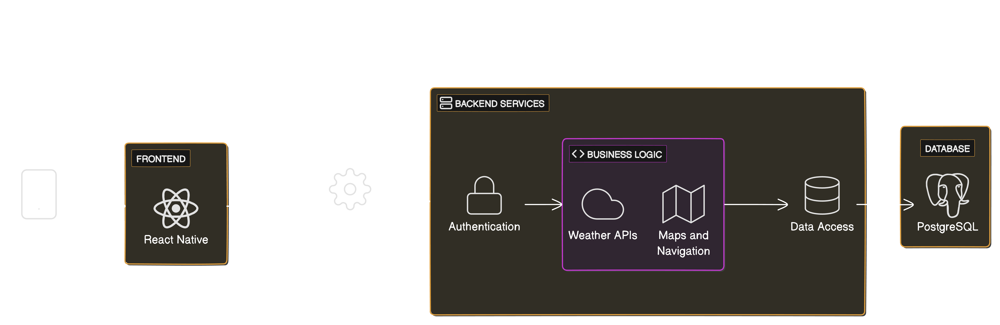

# LEEDS BECKETT UNIVERSITY
**SCHOOL OF BUILT ENVIRONMENT, ENGINEERING AND COMPUTING**


## Small Urban Park Environments &amp; Residents (SUPER) Mobile Application Prototype for the Leeds Sustainability Institute (LSI)

Submitted to Leeds Beckett University in partial fulfilment of the requirements for the degree of MSc Information and Technology 

By ***Albert Tarkaa Ago, Student ID: 77368783***

Supervised by ***[Dr. Gopal Jamnal](https://www.leedsbeckett.ac.uk/staff/dr-gopal-jamnal)***

September, 2024


## Project Overview

This project involves:
- Researching similar initiatives.
- Designing and developing a prototype app.
- Utilizing OpenStreetMap data or Mapbox for park information.

## Architecture

The architecture of the app is as follows:



### Components

- **Mobile App**: Built with React Native for both iOS and Android platforms.
- **Backend Services**: Developed using Spring Boot.
- **Database**: PostgreSQL is used for data storage.

## Features

### Must-Have Features - These are the fundamental features the app must have to meet user expectations

- Users can locate parks and green spaces within Leeds city. 
- Directions on how to access the parks and green spaces on foot, by cycle and by bus.
- Details about parks and green spaces facilities and accessibility, family and children friendliness including toilets, benches, bins, water fountains and sand areas.
- Information on the events happening, and when parks and green spaces are open.
- Access to microclimate and air quality data - Display of average and current air quality data, UV levels, and pollen count in the parks and green spaces.

### Performance Features - These features will directly impact user satisfaction

- Information about amenities near parks and green spaces and in the vicinity (cash machines, cafes, shops, car parks, secure bicycle parking).
- Information on walking trails and what users can see along the way.
- Information about plant and tree species as well as parks and green spaces initiatives e.g. no-mow May.
- Art in the parks and green spaces - Historical and cultural references.
- Display of all green and blue spaces users can walk to within 10 minutes.
- Filters are available to show or hide a map of the parks and green spaces along with their various facilities.

### Delight Features - These features will significantly enhance their overall experience
 
- Informative and engaging messages about the benefits of parks and green spaces air quality, e.g., air quality comparisons between city square and Park square.


## Get started

Dependencies

- Visual Studio Code (IDE)
- Node: v20.12.1
- NPM: 10.8.1
- React Native: ^0.74.3
- Expo: ^51.0.17

1. Install dependencies

   ```bash
   npm install
   ```

2. Start the app

   ```bash
    npx expo start
   ```

## To build for Android

1. Configure your build

```
eas build:configure
```

2. Initiate build after adding values to .env file
```bash
eas build --profile apk --non-interactive --no-wait --platform android
```
